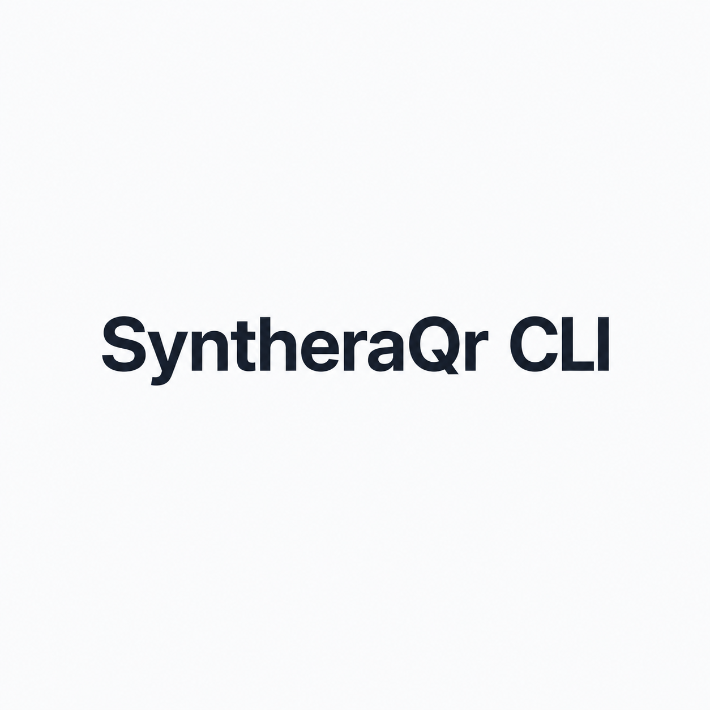

<div align="center">



# SyntheraQR

Ultra-modern QR code generation — web and terminal.

**[Website](https://syntheraqr.site)** · **[CLI](https://github.com/Synthera-Qr/synthera-qr-cli)** · **[Web App](https://github.com/Synthera-Qr/SyntheraQr)**

</div>

---

SyntheraQR is a QR code generator built with pixel-perfect fidelity to
[`qr-code-styling`](https://github.com/kozakdenys/qr-code-styling) 1.5.0.
Same rendering engine, same output — available as a web app and a CLI tool.

### Features

- Rounded-corner modules, pills, dots, finder patterns — matching the web engine exactly
- Gradient support (`--fg2` diagonal gradient in CLI, live gradient picker on the web)
- Export as PNG, JPG, SVG, or WebP
- Fully offline for generation, rendering, and decoding
- Terminal preview via kitty graphics protocol (CLI)
- Decode QR codes back to text (CLI)

### Repos

| | Description |
| --- | --- |
| [`SyntheraQr`](https://github.com/Synthera-Qr/SyntheraQr) | Web app — plain HTML/Tailwind + `qr-code-styling` JS |
| [`synthera-qr-cli`](https://github.com/Synthera-Qr/synthera-qr-cli) | CLI tool — Rust, feature parity with the web app |

### Install

**Web:** [syntheraqr.site](https://syntheraqr.site)

**CLI:**

```sh
curl -fsSL https://syntheraqr.netlify.app/install | bash
```

### License

MIT
